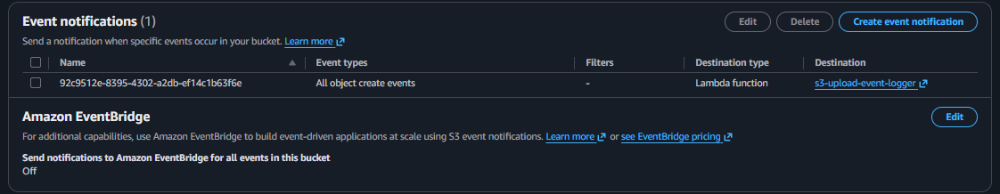
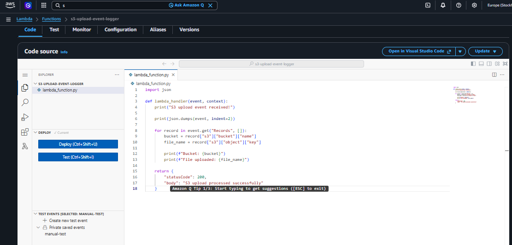
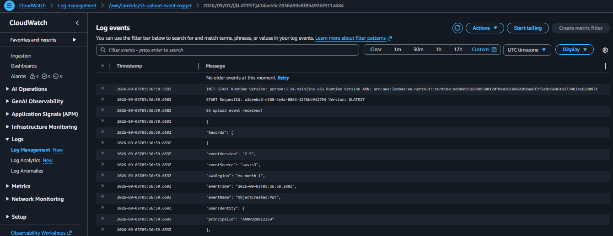

# S3 Event-Driven Lambda Logger

> An event-driven AWS project that automatically triggers an AWS Lambda function whenever a new object is uploaded to an Amazon S3 bucket. The Lambda function processes the S3 event and logs the bucket name and uploaded file name to Amazon CloudWatch Logs.

## 🏗️ Architecture Diagram

```text
                Upload File
                    |
                    v
          +---------------------+
          |     Amazon S3       |
          |  iam-project3-      |
          | s3-dhanushri-2026   |
          +----------+----------+
                     |
                     | ObjectCreated Event
                     v
          +---------------------+
          |   AWS Lambda        |
          | s3-upload-event-    |
          | logger              |
          +----------+----------+
                     |
                     | Logs
                     v
          +---------------------+
          |   Amazon            |
          |   CloudWatch Logs   |
          +---------------------+
```

## 🛠️ AWS Services Used

- **Amazon S3** — Stores objects and generates object creation events.
- **AWS Lambda** — Processes the S3 event automatically.
- **Amazon CloudWatch Logs** — Stores and displays Lambda execution logs.
- **AWS IAM** — Provides the permissions required for Lambda and CloudWatch logging.

## 🎯 Project Objective

The objective of this project is to build a simple serverless event-driven workflow:

1. Upload a file to an S3 bucket.
2. S3 generates an `ObjectCreated` event.
3. The event automatically invokes the Lambda function.
4. Lambda reads the S3 event.
5. Lambda prints the bucket name and uploaded file name.
6. CloudWatch Logs records the Lambda execution.

This demonstrates how AWS services can communicate automatically without manually invoking the Lambda function.

## 🪣 S3 Configuration

| Setting     | Value                                  |
|---------------|---------------------------------------------|
| Bucket Name        | `iam-project3-s3-dhanushri-2026`                |
| Region                | Europe (Stockholm) — `eu-north-1`                 |

### S3 Event Notification

| Setting        | Value                              |
|-------------------|------------------------------------------|
| Event Type              | All object create events                     |
| Destination                | Lambda function                                 |
| Lambda Target                 | `s3-upload-event-logger`                            |


`s3-event-notification.png`

## ⚡ Lambda Function

| Setting       | Value                        |
|------------------|------------------------------------|
| Function Name          | `s3-upload-event-logger`               |
| Runtime                   | Python 3.14                              |

The Lambda function receives the S3 event and extracts:

- S3 bucket name
- Uploaded object key / file name

### Lambda Code

```python
import json

def lambda_handler(event, context):
    print("S3 upload event received!")

    print(json.dumps(event, indent=2))

    for record in event.get("Records", []):
        bucket = record["s3"]["bucket"]["name"]
        file_name = record["s3"]["object"]["key"]

        print(f"Bucket: {bucket}")
        print(f"File uploaded: {file_name}")

    return {
        "statusCode": 200,
        "body": "S3 upload processed successfully"
    }
```


`lambda-function-code.png`

## ☁️ CloudWatch Logs

Lambda automatically sends its execution logs to Amazon CloudWatch Logs.

**Log Group:** `/aws/lambda/s3-upload-event-logger`

When an S3 upload triggers the Lambda function, the logs contain messages such as:

```text
S3 upload event received!

Bucket: iam-project3-s3-dhanushri-2026

File uploaded: lambda-test.txt
```

The CloudWatch log also shows the S3 event details, including:

```text
eventSource: aws:s3
eventName: ObjectCreated:Put
```


`cloudwatch-s3-event-log.png`

## 🔄 How the Project Works

| Step | Action                              |
|--------|------------------------------------------|
| 1           | Upload a file (e.g. `lambda-test.txt`) to the S3 bucket. |
| 2           | S3 detects the object creation and generates an `ObjectCreated` event. |
| 3           | The S3 event notification invokes `s3-upload-event-logger`. |
| 4           | Lambda reads `record["s3"]["bucket"]["name"]` and `record["s3"]["object"]["key"]` to get the bucket name and uploaded file name. |
| 5           | Lambda writes the extracted details to CloudWatch Logs. |

## 🧪 Testing

The project can be tested by uploading a new object (e.g. `lambda-test.txt`) to the configured S3 bucket.

```text
S3
 |
 v
ObjectCreated event
 |
 v
Lambda
 |
 v
CloudWatch Logs
```

The CloudWatch Logs should show the uploaded file name and bucket name.

## 📊 Expected Result

A successful execution should contain:

```text
S3 upload event received!
```

followed by the S3 event information and:

```text
Bucket: iam-project3-s3-dhanushri-2026
File uploaded: lambda-test.txt
```

The Lambda execution should complete successfully with a `200` response.

## 🔐 IAM Permissions

The Lambda execution role requires permission to write execution logs to CloudWatch Logs:

```text
logs:CreateLogGroup
logs:CreateLogStream
logs:PutLogEvents
```

The S3 bucket also needs permission to invoke the Lambda function through the S3 event notification configuration.

## 📸 Project Screenshots

| Screenshot                        | Evidence                                  |
|-------------------------------------|------------------------------------------------|
| `lambda-function-code.png`               | Shows the deployed Lambda function code              |
| `s3-event-notification.png`                | Shows the S3 → Lambda event notification setup          |
| `cloudwatch-s3-event-log.png`                | Shows the CloudWatch log output after an S3 upload          |

## 💡 Key AWS Concepts Demonstrated

- Serverless computing
- Event-driven architecture
- Amazon S3 event notifications
- AWS Lambda
- Lambda event handling
- Amazon CloudWatch Logs
- IAM permissions
- S3 → Lambda integration
- Automated event processing

## 🧹 Cleanup

After completing the demonstration:

- Remove the test object(s) uploaded to the S3 bucket, or delete the bucket if it isn't needed elsewhere.
- Delete the `s3-upload-event-logger` Lambda function if no longer required.
- Remove the S3 event notification configuration if the bucket is being reused for another purpose.
- Delete the associated CloudWatch Log Group (`/aws/lambda/s3-upload-event-logger`) if the logs are no longer needed.
- Remove the Lambda execution IAM role if it isn't reused by another project.

## 🏆 Project Outcome

This project demonstrates a complete S3 → Lambda → CloudWatch event-driven workflow.

Instead of manually running the Lambda function whenever a file is uploaded, the S3 event notification automatically invokes Lambda, allowing the application to react to new objects in real time.
