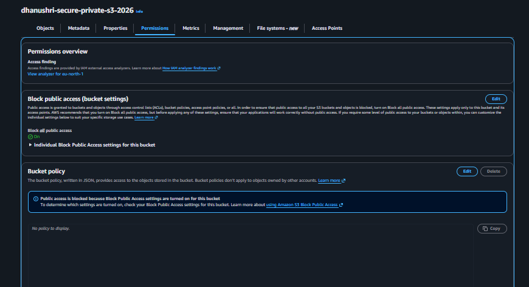

# Secure Private S3 Bucket

## What this project does
Created a private S3 bucket (`dhanushri-secure-private-s3-2026`) with 
Block Public Access enabled, and an IAM policy granting least-privilege 
access (list, get, put — no delete or public exposure).

## Architecture
IAM User/Role → Permission → S3 Bucket → Private Data

## Steps taken
1. Created S3 bucket
2. Enabled Block Public Access (all 4 settings ON)
3. Confirmed no bucket policy applied — access controlled via IAM, not public exposure
4. Created IAM policy with s3:ListBucket, s3:GetObject, s3:PutObject only
5. Attached policy to IAM user
6. Verified upload/download works through IAM permissions, not public access

## Screenshots

### Block Public Access enabled

Bucket has Block Public Access turned ON with no bucket policy applied — 
all access is controlled through IAM permissions rather than public exposure.

## What I learned
Blocking public access at the bucket level and controlling access through 
IAM policies is a stronger security model than relying on bucket policies 
alone — it follows the principle of least privilege.
